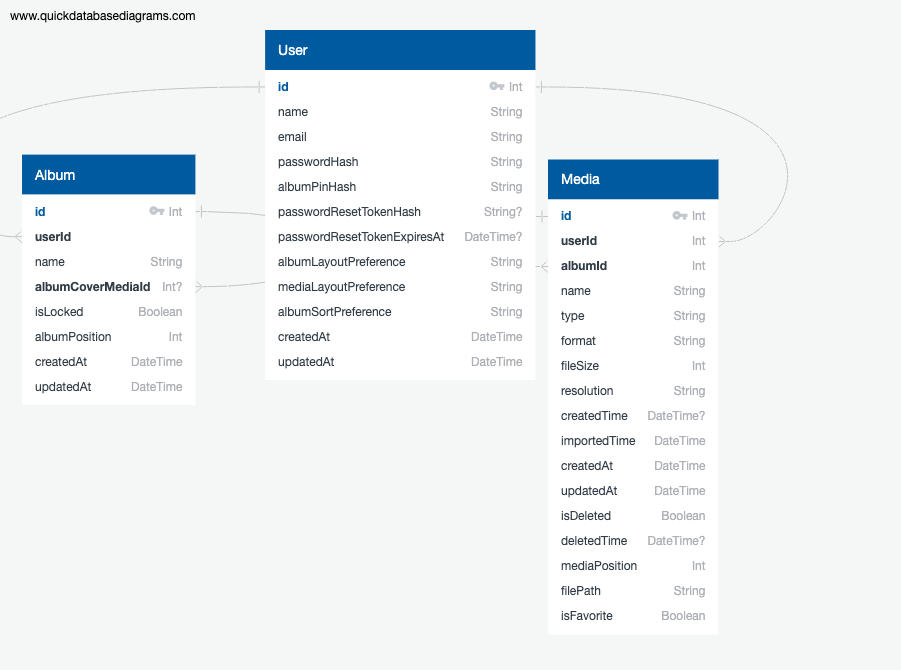

# MediaVault

MediaVault is a full-stack media storage and vault web application for securely organizing photos and videos.

The app allows users to create albums, upload media, lock albums with a PIN, favorite files, move media between albums, view file details, and store uploaded files in private Amazon S3 cloud storage.

## Tech Stack

- React.js, JavaScript, CSS3, HTML5, Fetch API (Frontend)
- Node.js, Express.js, Multer (Backend)
- PostgreSQL, Prisma ORM (Database)
- Amazon S3, AWS IAM, signed URLs (Cloud Storage)
- Docker, Terraform, CI/CD (Planned)

## Current Features

### Authentication

- User signup and login
- JWT-protected routes
- Forgot password reset-token flow
- Password reset page

### Albums

- Create albums
- Rename albums
- Delete albums
- Sort albums by name, date created, and date modified
- Set custom album covers
- Lock & unlock albums with a PIN
- Add and remove album locks

### Media

- Upload photos and videos
- Drag-and-drop upload support
- Store uploaded media in private Amazon S3 storage
- View images and videos through temporary signed URLs
- Move individual media items to another album
- Move multiple selected media items to another album
- Delete individual media items
- Delete multiple selected media items
- Delete S3 objects when media is deleted
- Favorite and unfavorite media
- View file information such as name, type, format, size, resolution, created date, and imported date

## Planned Features (Upgrades)

- Change account password
- Change locked album PIN
- Change profile username
- Organize photos/videos via drag-and-drop
- Recently Deleted album
- Recover deleted photos/videos
- Permanently delete photos/videos
- Download/export photos/videos
- Rename photos/videos

## Planned Features (Polish)

- Create sub-albums
- Change album page layout
- Change photos/videos page layout
- Custom album ordering
- Add tags to photos/videos

## Planned Features (AI / Advanced)

- Duplicate detection
- Photo/video categorization
- Auto-generate tags for photos/videos
- Smart search such as "dog", "beach", or "family"
- Other AI-assisted organization features

## AWS Integration

MediaVault uses Amazon S3 for private cloud file storage.

Uploaded files are handled with `multer.memoryStorage()` so files are temporarily held in backend memory before being uploaded to S3. Files are not saved to the local backend filesystem.

The database stores each file's S3 object key (unique identifier for a file) in `Media.filePath`. Since the S3 bucket is private, the backend generates temporary signed URLs when media needs to be displayed in the frontend.

Media deletion is also connected to S3. When a user deletes a media item, deletes multiple media items, or deletes an album, the related S3 objects are deleted as well.

High-level flow:

```txt
Upload:
React frontend → Express backend → Multer memory storage → Amazon S3 → Prisma stores S3 object key

View:
React frontend → Express backend → Prisma filePath → temporary signed S3 URL → image/video renders in browser

Delete:
React frontend → Express backend → delete S3 object → delete Prisma media record
```

## Common Commands

### Frontend

Run the frontend server:

```bash
cd frontend
npm run dev
```

### Backend

Run the backend server:

```bash
cd backend
npm run dev
```

### Prisma / Database

After changing `schema.prisma`, create and apply a migration:

```bash
cd backend
npx prisma migrate dev --name <describe-changes-here>
```

Check whether the database is up to date with the Prisma migrations:

```bash
npx prisma migrate status
```

Validate the Prisma schema:

```bash
npx prisma validate
```

Regenerate the Prisma Client if needed:

```bash
npx prisma generate
```

If the backend logs errors such as:

- column does not exist
- table does not exist
- unknown field

then Prisma, the generated Prisma Client, and the database may be out of sync. Run the migration/status/validate/generate commands above and restart the backend.

Open Prisma Studio to visually inspect local database records:

```bash
npx prisma studio
```

### PostgreSQL

Open PostgreSQL shell:

```bash
psql postgres
```

Quit PostgreSQL shell:

```sql
\q
```

### Node Version

Use the project Node version from `.nvmrc`:

```bash
nvm use
```

Check the current Node version:

```bash
node -v
```

## Database Schema

The current database schema includes users, albums, and media records.



A PDF version is also available in `docs/mediavault-current-database-erd.pdf`.

## Wireframes & UI Planning

Early hand-drawn wireframes are included in `docs/wireframes/` to show the initial planning stages and UI direction for the project.

## Status

In development. Core MVP features implemented locally.

## Author

Truitt Janney
