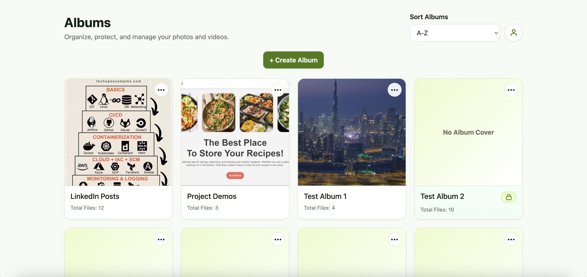
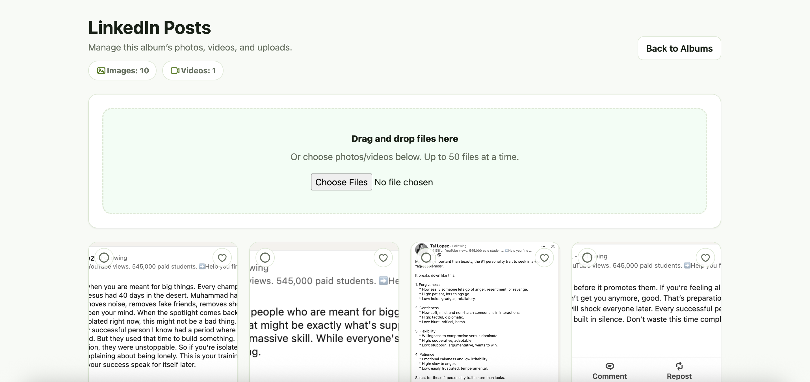
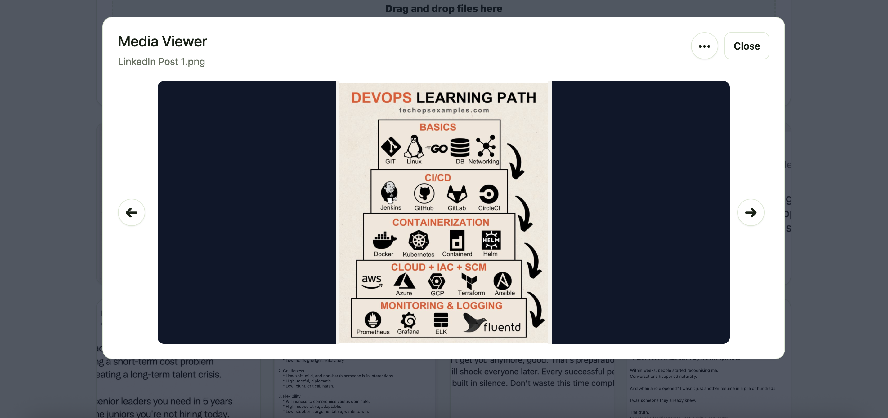
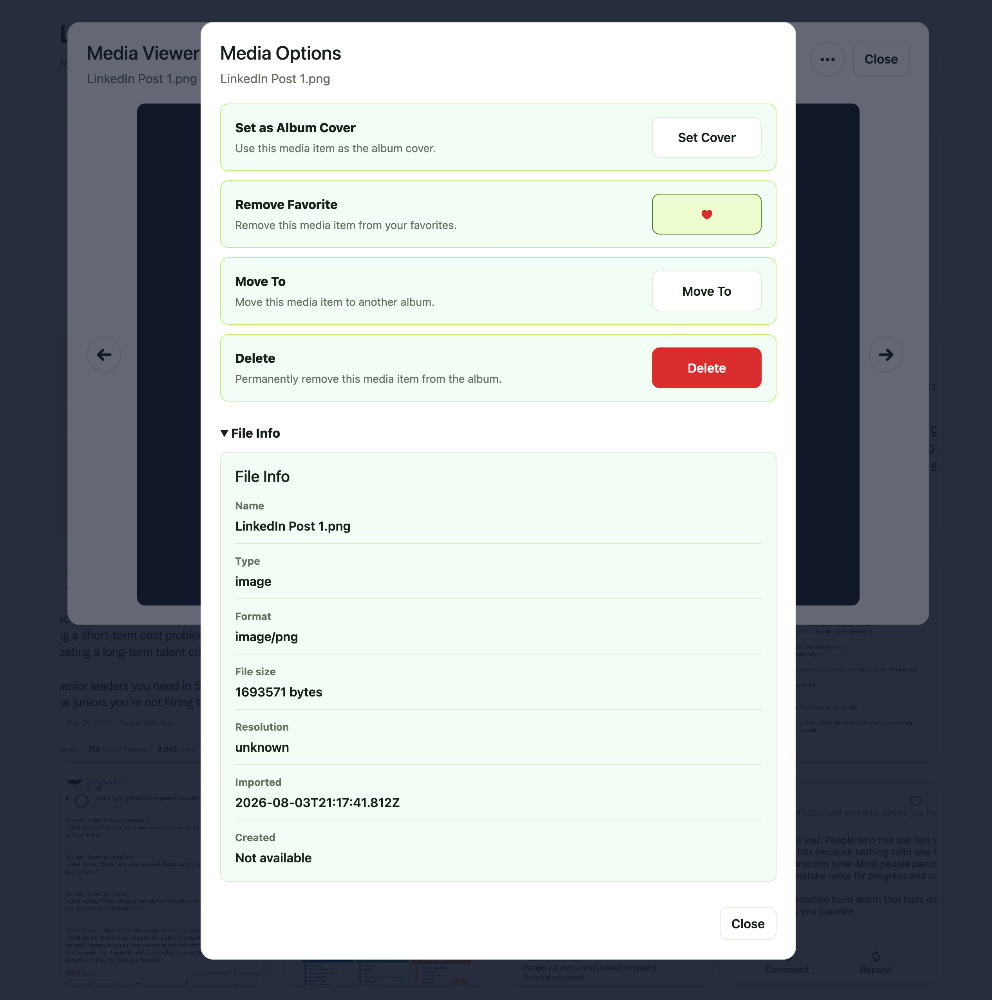
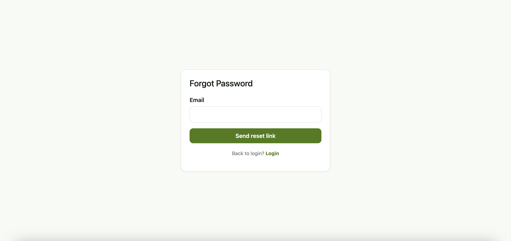
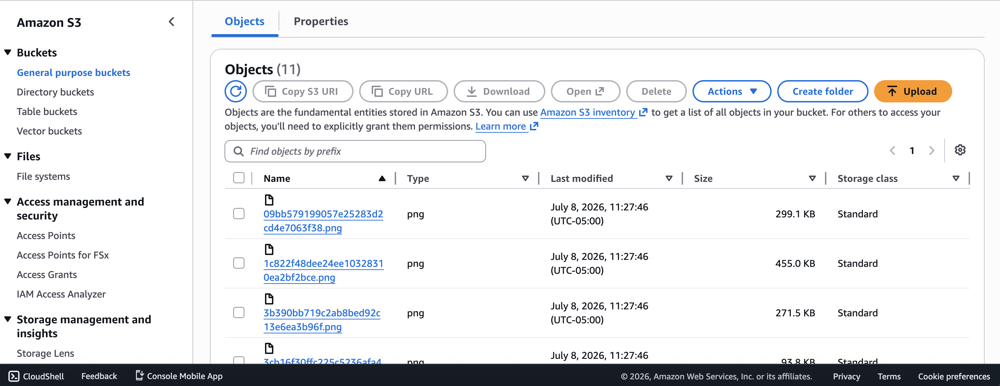
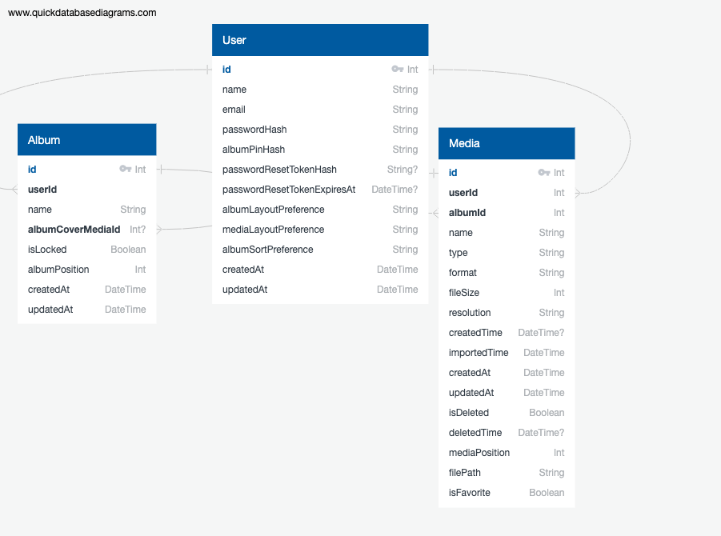

# MediaVault

MediaVault is a full-stack media storage and vault application for securely organizing photos and videos.

Users can create and manage albums, upload media, protect albums with a PIN, favorite files, move media between albums, inspect file metadata, and view privately stored Amazon S3 objects through temporary presigned URLs.

## Live Application

- Frontend: https://mediavault.truittjanney.com
- API: https://api.mediavault.truittjanney.com

Public account registration is intentionally disabled in production to prevent unauthorized storage usage.

## Tech Stack

### Frontend

- React.js
- JavaScript
- Vite
- CSS3
- HTML5
- Fetch API
- Vercel

### Backend

- Node.js
- Express.js
- Multer
- JSON Web Tokens
- bcrypt
- Railway

### Database

- PostgreSQL
- Prisma ORM
- Railway PostgreSQL

### AWS

- Amazon S3
- Amazon Simple Email Service (SES)
- AWS Identity and Access Management (IAM)
- Amazon Route 53
- S3 presigned URLs

### Planned DevOps Infrastructure

- Docker
- Terraform
- GitHub Actions
- CI/CD
- Amazon CloudFront
- AWS Certificate Manager
- Amazon CloudWatch
- Amazon SNS

## Production Architecture

MediaVault separates local development resources from production resources.

```txt
Frontend Hosting:
Vercel
https://mediavault.truittjanney.com

Backend Hosting:
Railway
https://api.mediavault.truittjanney.com

Production Services:
Railway PostgreSQL
Amazon S3
Amazon SES
Amazon Route 53
```

```md
The frontend communicates with the Railway API through HTTPS. The backend manages authentication and application logic, stores relational data in Railway PostgreSQL, stores media objects in private Amazon S3 storage, and sends transactional password-reset emails through Amazon SES.
```

## Completed Features

### Authentication

- User signup and login
- JWT-protected API routes
- Password-reset token generation and expiration
- Password-reset emails delivered through Amazon SES
- Password-reset page with token validation
- Generic forgot-password responses to prevent account enumeration
- Public signup controlled through environment configuration

### Albums

- Create albums
- Rename albums
- Delete albums
- Sort albums by name, date created, and date modified
- Set custom album covers
- Add and remove album locks
- Unlock protected albums through PIN verification

### Media

- Upload photos and videos
- Drag-and-drop upload support
- Store uploaded media in private Amazon S3 storage
- View images and videos through temporary signed URLs
- Move individual media items to another album
- Move multiple selected media items to another album
- Delete individual media items
- Delete multiple selected media items
- Delete S3 objects when media is deleted
- Favorite and unfavorite media
- View file information such as name, type, format, size, resolution, created date, and imported date

## Planned Features (Upgrades)

- Change account password
- Change locked album PIN
- Change profile username
- Organize photos/videos via drag-and-drop
- Recently Deleted album
- Recover deleted photos/videos
- Permanently delete photos/videos
- Download/export photos/videos
- Rename photos/videos

## Planned Features (Polish)

- Create sub-albums
- Change album page layout
- Change photos/videos page layout
- Custom album ordering
- Add tags to photos/videos

## Planned Features (AI / Advanced)

- Duplicate detection
- Photo/video categorization
- Auto-generate tags for photos/videos
- Smart search such as "dog", "beach", or "family"
- Other AI-assisted organization features

## Screenshots

### Albums Page



### Album Detail Page



### Media Viewer



### Media Options



### Forgot Password Page



### Private S3 Storage



## AWS Integration

MediaVault uses Amazon S3 for private cloud file storage.

Uploaded files are handled with `multer.memoryStorage()` so files are temporarily held in backend memory before being uploaded to S3. Files are not saved to the local backend filesystem.

The database stores each file's S3 object key (unique identifier for a file) in `Media.filePath`. Since the S3 bucket is private, the backend generates temporary signed URLs when media needs to be displayed in the frontend.

Media deletion is also connected to S3. When a user deletes a media item, deletes multiple media items, or deletes an album, the related S3 objects are deleted as well.

A screenshot of the private S3 object structure is included in `docs/screenshots/`.

High-level flow:

```txt
Upload:
React frontend → Express backend → Multer memory storage → Amazon S3 → Prisma stores S3 object key

View:
React frontend → Express backend → Prisma reads Media.filePath → temporary signed S3 URL → image/video renders in browser

Delete:
React frontend → Express backend → delete S3 object → delete Prisma media record
```

MediaVault also uses Amazon SES to deliver transactional password-reset emails in production. The sending identity uses the `mediavault.truittjanney.com` domain with Easy DKIM and a DMARC DNS record. The production backend has a least-privilege IAM policy allowing email delivery only through the MediaVault SES identity and approved sender address.

## Environment Variables

Create local `.env` files using the provided `.env.example` files as a guide. Production variables are configured through Railway and Vercel and are not committed to the repository.

### Backend — Local Development

```env
DATABASE_URL=
JWT_SECRET=
PORT=5001

FRONTEND_URL=http://localhost:5173

AWS_REGION=us-east-2
S3_BUCKET_NAME=
AWS_ACCESS_KEY_ID=
AWS_SECRET_ACCESS_KEY=

SES_FROM_EMAIL=

ALLOW_PUBLIC_SIGNUP=false
```

Leave `SES_FROM_EMAIL` empty to print password-reset links in the local backend terminal. Set `ALLOW_PUBLIC_SIGNUP=true` locally when account-creation testing is needed.

### Frontend - Local Development

```env
VITE_API_BASE_URL=http://localhost:5001
```

### Production Configuration

Production environment variables are managed through Vercel and Railway rather than committed to the repository.

```txt
Vercel:
VITE_API_BASE_URL=https://api.mediavault.truittjanney.com

Railway:
FRONTEND_URL=https://mediavault.truittjanney.com
SES_FROM_EMAIL=no-reply@mediavault.truittjanney.com
ALLOW_PUBLIC_SIGNUP=false
```

Production database credentials, AWS credentials, JWT secrets, and other sensitive values are stored only in their corresponding deployment platforms.

## Common Commands

### Frontend

Run the frontend server:

```bash
cd frontend
npm run dev
```

### Backend

Run the backend server:

```bash
cd backend
npm run dev
```

### Prisma / Database

After changing `schema.prisma`, create and apply a migration:

```bash
cd backend
npx prisma migrate dev --name <describe-changes-here>
```

Check whether the database is up to date with the Prisma migrations:

```bash
npx prisma migrate status
```

Validate the Prisma schema:

```bash
npx prisma validate
```

Regenerate the Prisma Client if needed:

```bash
npx prisma generate
```

If the backend logs errors such as:

- column does not exist
- table does not exist
- unknown field

then Prisma, the generated Prisma Client, and the database may be out of sync. Run the migration/status/validate/generate commands above and restart the backend.

Open Prisma Studio to visually inspect local database records:

```bash
npx prisma studio
```

### PostgreSQL

Open PostgreSQL shell:

```bash
psql postgres
```

Quit PostgreSQL shell:

```sql
\q
```

### Node Version

Use the project Node version from `.nvmrc`:

```bash
nvm use
```

Check the current Node version:

```bash
node -v
```

## Database Schema

The current database schema includes users, albums, and media records.



A PDF version is also available in `docs/mediavault_current_database_erd.pdf`.

## Wireframes & UI Planning

Early hand-drawn wireframes are included in `docs/wireframes/` to show the initial planning stages and UI direction for the project.

## Project Status

MediaVault's core MVP is complete and deployed to production.

Completed production infrastructure includes:

- Vercel frontend deployment
- Railway backend deployment
- Railway PostgreSQL database
- Separate development and production S3 storage
- Custom frontend and backend domains
- Route 53 DNS delegation
- Production CORS configuration
- Automated Prisma migration deployment
- Amazon SES password-reset email delivery
- DKIM and DMARC email authentication
- Least-privilege IAM policies
- End-to-end authentication, media upload, S3 deletion, and password-reset testing

Public signup is intentionally disabled in production. Additional product features and a separate Docker, Terraform, AWS, and CI/CD infrastructure phase are planned.

## Author

Truitt Janney
